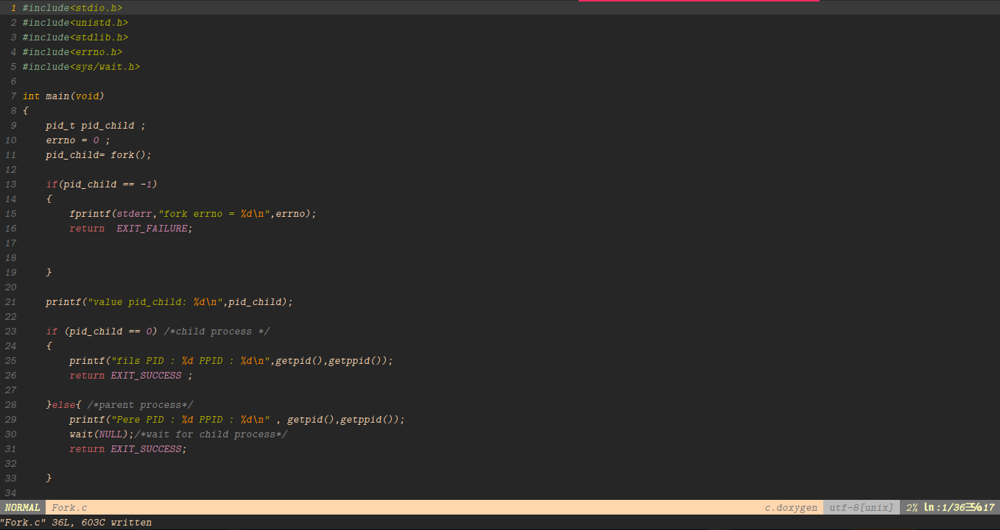
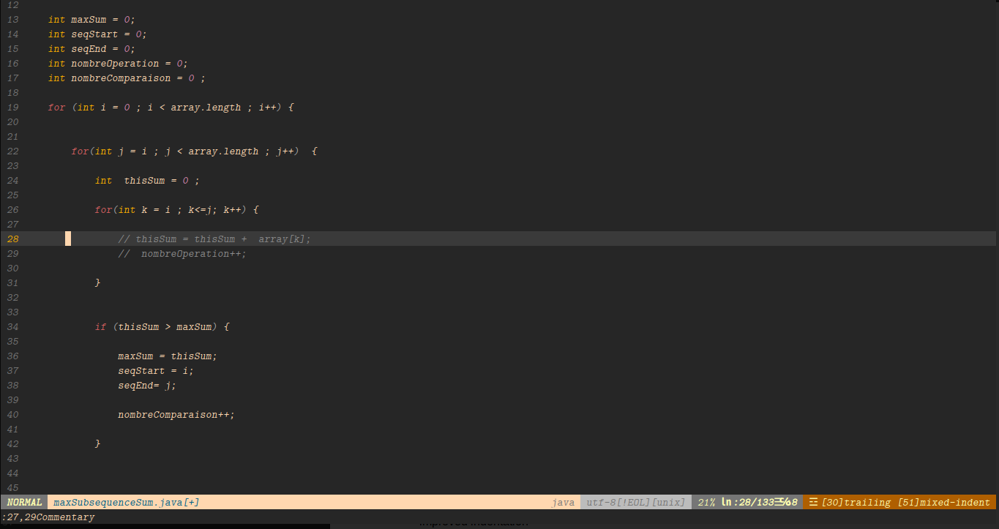
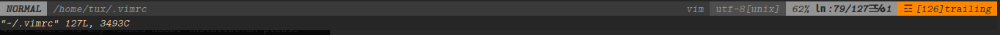
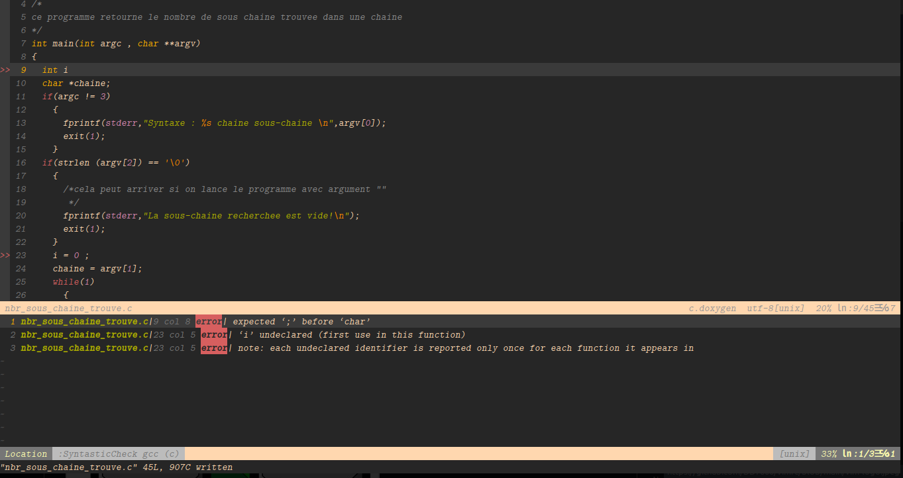

# vim 

my config ``.vimrc`` file 

- Advance: if you wanna use Vim like a IDE this include a lot of useful plugins.

# Installation

``git clone https://github.com/DD7600/vimrc ``

``cd vimrc``

``./install.sh``

by default this script save your old config to ``~/.vimrc.save`` if you wanna use your old config file

by defaults this script install vim-plug by default if you wanna install another one click here
[how-to-install-vim-plugins](https://opensource.com/article/20/2/how-install-vim-plugins )

# Useful plugins already installed

## enable awesome theme ``gruvobx`` by default

## Dashborad

https://github.com/junegunn/vim-github-dashboard.git
Browse Github events (user dashboard,user/repo activity) in vim

type in vim
``:GHDashbord ``

or

``:GHDashbord USER ``
or 

``:GHActivity USER/REPO``

more information [click-here](https://github.com/junegunn/vim-github-dashboard.git)

## Commentary

https://github.com/tpope/vim-commentary
use to comments line inside vim
type in vim

``:27,29Commentary``

to comment line 27 to 29

## Airline
https://github.com/vim-airline/vim-airline give information about the file path,line,column,encoding ..

## syntastic
compile every time you save a file to see  errors on any type of file .c .cpp .html .java .py . . .

## javascript

https://github.com/pangloss/vim-javascript.git javascript plugins provide syntax highlighting and improved indentation

# Plugins
if you wanna see more plugins available for vim
check [vim-plugins](https://github.com/gerardbm/vimrc)

## Issues
if there is any issues about installation please let me know